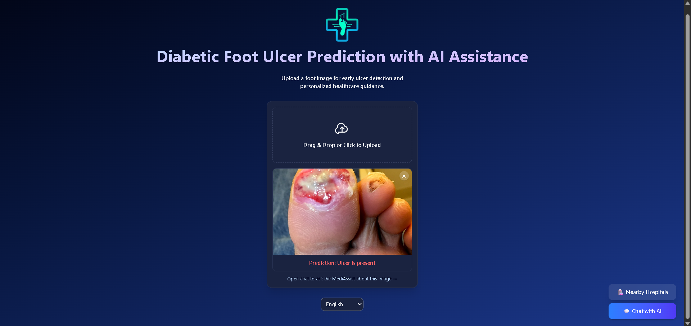
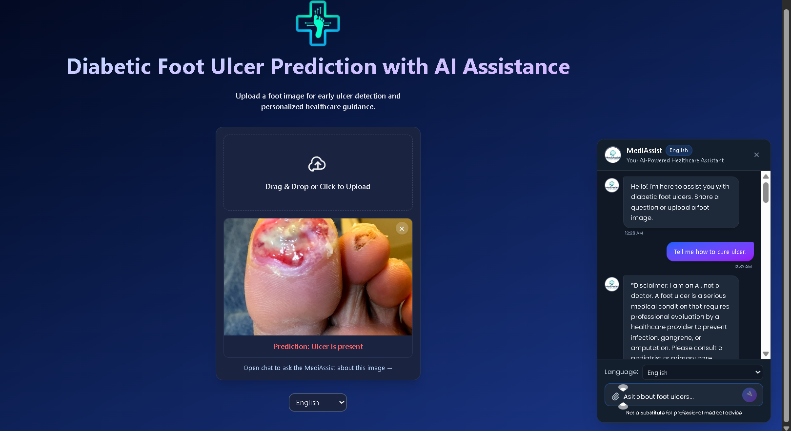
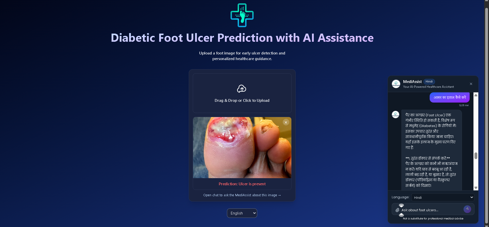
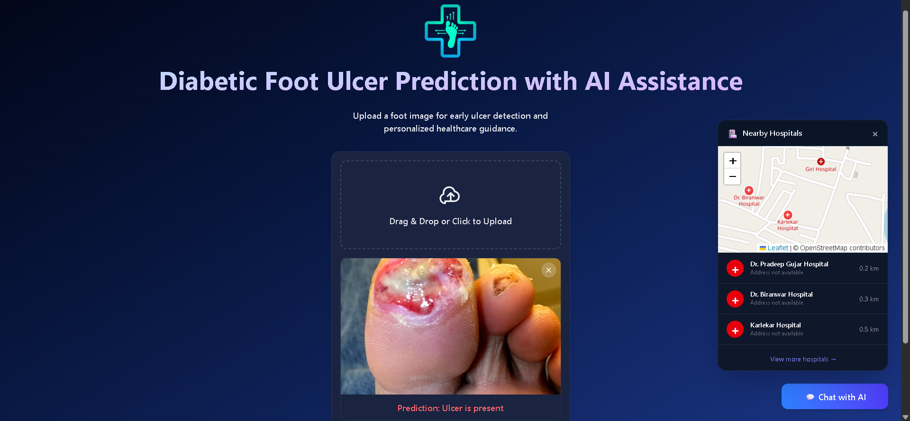
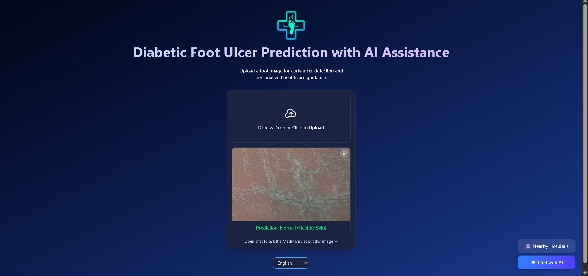

# 🩺 DFU Detection System using Vision Transformer

An AI-powered **Diabetic Foot Ulcer (DFU) Detection System** that leverages a **Vision Transformer (ViT)** for accurate wound image classification. The project includes a **FastAPI backend** for model inference and a **React (Vite) frontend** for an intuitive user interface. Additionally, it provides **location-based hospital recommendations** using OpenStreetMap and Leaflet.

---

## 🚀 Features

* 🧠 Vision Transformer (ViT) model for DFU detection
* ⚡ FastAPI REST API for real-time inference
* 🌐 React + Vite frontend
* 📍 Nearby hospital recommendations using OpenStreetMap & Leaflet
* 📊 Comparison of ViT, CNN, and YOLO architectures
* 📈 Optimized for imbalanced medical datasets

---

# 📂 Project Structure

```text
FOOT-ULCER/
│
├── Backend/
│   ├── app/
│   │   ├── routes/
│   │   ├── model.py
│   │   ├── model.pth
│   │   └── __pycache__/
│   │
│   ├── app.py
│   ├── requirements.txt
│   ├── test.py
│   ├── .env
│   └── .env.sample
│
├── Frontend/
│   ├── public/
│   ├── src/
│   ├── package.json
│   ├── package-lock.json
│   ├── vite.config.js
│   ├── eslint.config.js
│   ├── index.html
│   └── README.md
│
├── .gitignore
└── README.md
```

---

# 🛠️ Tech Stack

### AI & Deep Learning

* PyTorch
* Vision Transformer (ViT)
* CNN
* YOLO

### Backend

* FastAPI
* Python
* Uvicorn

### Frontend

* React
* Vite
* JavaScript

### Data Processing

* NumPy
* Pandas

### Maps

* OpenStreetMap
* Leaflet.js

---

# 📊 Model Performance

| Metric               | Vision Transformer |
| -------------------- | -----------------: |
| Accuracy             |            **92%** |
| Precision            |            **91%** |
| Sensitivity (Recall) |            **93%** |

### Comparative Analysis

The project compares three deep learning architectures:

* Vision Transformer (ViT)
* Convolutional Neural Network (CNN)
* YOLO

Evaluation metrics include:

* Accuracy
* Precision
* Recall (Sensitivity)
* F1 Score
* Confusion Matrix

The Vision Transformer achieved the best performance, particularly on imbalanced medical datasets.

---
## 🏋️ Train the Model

Open and run:

```text

modeltrain.ipynb

```

After training, the notebook will generate:

```text

model.pth

```

Save this file inside:

```text

Backend/models
# ⚙️ Installation

## 1. Clone Repository

```bash
git clone https://github.com/your-username/FOOT-ULCER.git
cd FOOT-ULCER
```

---

## 2. Backend Setup

```bash
cd Backend

python -m venv venv

# Windows
venv\Scripts\activate

# Linux/macOS
source venv/bin/activate

pip install -r requirements.txt
```

Run the API:

```bash
uvicorn app:app --reload
```

The backend will start at:

```text
http://127.0.0.1:8000
```

---

## 3. Frontend Setup

```bash
cd Frontend

npm install

npm run dev
```

The frontend will be available at:

```text
http://localhost:5173
```

---

# 🔄 System Workflow

1. Upload a diabetic foot wound image.
2. The backend preprocesses the image.
3. The Vision Transformer predicts whether an ulcer is present.
4. FastAPI returns the prediction and confidence score.
5. The frontend displays the result.
6. Nearby hospitals are shown using OpenStreetMap and Leaflet.

---

# 📡 API Endpoint

Example prediction endpoint:

```http
POST /predict
```

Example request:

```bash
curl -X POST \
  -F "file=@image.jpg" \
  http://127.0.0.1:8000/predict
```

Example response:

```json
{
  "prediction": "Diabetic Foot Ulcer",
  "confidence": 0.94
}
```

---
# 🎯 Future Improvements

* Multi-class ulcer severity classification
* Explainable AI using Grad-CAM or attention visualization
* Docker deployment
* Cloud hosting (AWS/Azure/GCP)
* Patient history management
* Mobile application support

---

# 📸 Screenshots
<p align="center">
  
</p>
<p align="center">
  
</p>
<p align="center">
  
</p>
<p align="center">
  
</p>
<p align="center">
  
</p>


---

# 👨‍💻 Author

**Your Name**

* GitHub: https://github.com/your-username
* LinkedIn: https://linkedin.com/in/thevaibhavsengar

---

# 📄 License

This project is licensed under the MIT License.

---

⭐ If you found this project useful, consider starring the repository.
